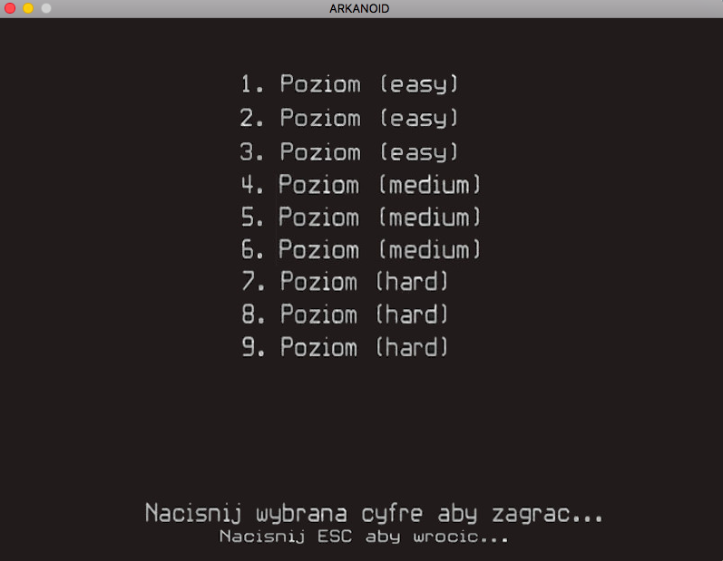

# Arkanoid

Modified arkanoid game written in C with SDL2 library. The game contains different shapes of blocks, an endless game mode, a set of prepared levels and a simple best scores saving.

## Compilation and running
```
cc -std=c99 `pkg-config --cflags --libs sdl2 SDL2_image SDL2_mixer SDL2_ttf` main.c menu.c dane.c game.c geometry.c -o main.o -o main
```

Use this line inside the source directory.
To start the game, type `./main` inside the source directory.

___
## Controls
+ Navigating in the main menu - digits, ESC.
+ Move of the platform and the first shot angle - arrows
+ First shot - ENTER
+ Pause - P
___

## Screenshots

### Main menu

### Best scores

### Levels page

### One of levels


### Endless game


